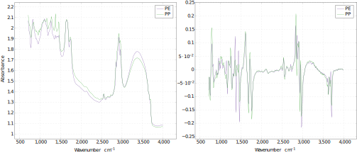

# [Explainable Detection of Microplastics Using Transformer Neural Networks](https://link.springer.com/chapter/10.1007/978-3-031-22695-3_8)

This repository provides supplementary material for the following publications (would appreciate a citation of our work if you find the tool useful)

M. Barker, M. Willans, D-S. Pham, A. Krishna, M. Hackett. Explainable Detection of Microplastics Using Transformer Neural Networks, in *[*Proceedings of the Australasian Joint Conference on Artificial Intelligence (AJCAI)*](https://ajcai2022.org/)*, Perth December 2022.

Available in this repository: 
- Reflectance micro-FTIR spectral data for standard and marine polymers
- Python code that implements the model 

## Setup and Execution
This code runs using pytorch-gpu which you can download from [pytorch.org/](https://pytorch.org/).

Assuming pytorch is installed you can run the program with:
```
python3 run.py
```

## Configuring

All of the variables that control the models hyperparameters are in `run.py`. I last tested this code on a GTX 1080ti, so you may be able to change certain hyperparameters. 

Currently the dataloaders load the micro-FTIR datasets that contain polyethylene and polypropylene in the `no_fp` directory. There is however an alternative option to train the model with filter paper samples. This can be done by using the csv files in the `with_fp` directory. Otherwise, you can extract the entire datasets in the `marine_polymers.csv` and `standard_polymers.csv` in the `data` directory.

You will need to change the global variable `LABEL_DICT` if you wish to use the filter paper samples. This can be done by changing: 
```py
LABEL_DICT = {'PP': 0,'PE':1}
```
to
```py
LABEL_DICT = {'PP': 0,'PE':1,'FP':2}
```

## Figures


### Reflectance Micro-FTIR Workflow

 
 
### Raw Marine Polymer Data and First Order Difference

 
### Best Performing Validation and Test Results

 
### Baseline Model Comparison

 
